# code_craft_2025

# 1. 前言

2025华为软件精英挑战赛，初赛3万分到3000万分，开发调试心得。

参考题解1：[churuikai/craft2025_pearcat: 2025华为软件精英挑战赛 总决赛最佳大模型应用奖](https://github.com/churuikai/craft2025_pearcat)。

参考题解2：[yulemao/huawei-code-craft2025: 2025华为软件精英挑战赛全球总决赛0b1000100题解](https://github.com/yulemao/huawei-code-craft2025)。

参考题解3：[MineQihang/CodeCraft2025-public: 2025华为软件精英挑战赛](https://github.com/MineQihang/CodeCraft2025-public)。

# 2. 文件结构

- **变量结构体封装**： 多个相似的变量封装为一个结构体！代码量就会少很多、方便阅读！
- **分文件编写**：读取、写入、删除，分文件编写，方便维护
- **全局头文件**：包含所有结构体定义、类定义、引用库、extern所有全局变量。
- **全局变量：**main中定义，global中extern，链接速度较快。使用inline的话，链接速度巨慢！

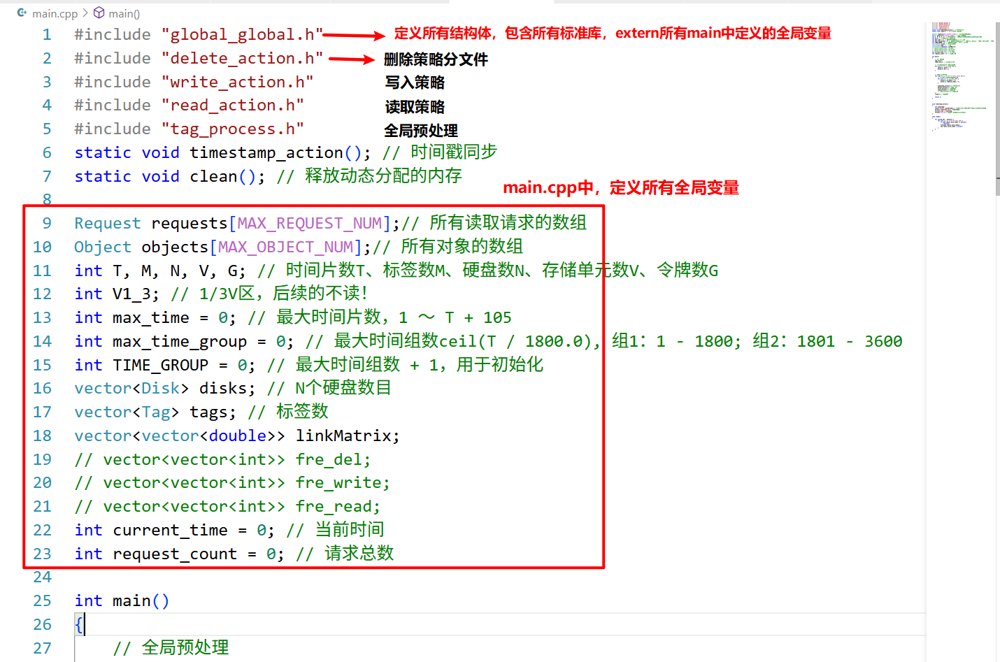

- **类设计**：磁盘类、分区类、存储单元类、对象类、请求类。面向对象设计，方便开发和维护代码！面向过程的代码会非常臃肿，理解难度会更高。

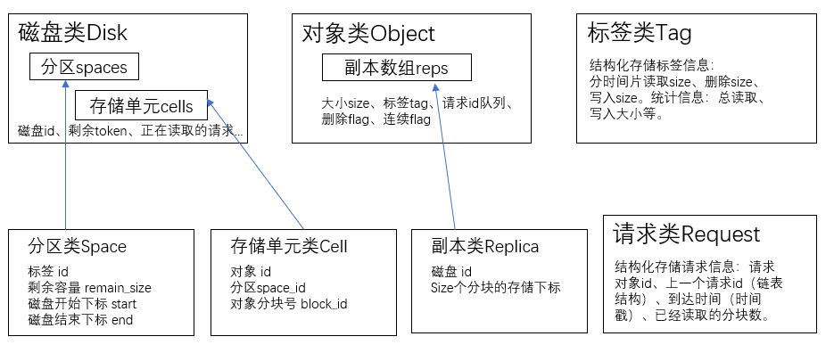

 

# 3. 全局预处理tag_process

1. **磁盘分区**：每个对象需要存3个副本，所以将所有的N个磁盘都平分为三个副本区；所有对象被进一步标记为最大16种标签，所以每个副本区再细分为16个标签区。

   优化：只读副本1的区域，副本2和副本3的区域（垃圾区）就可以顺序碎存。

   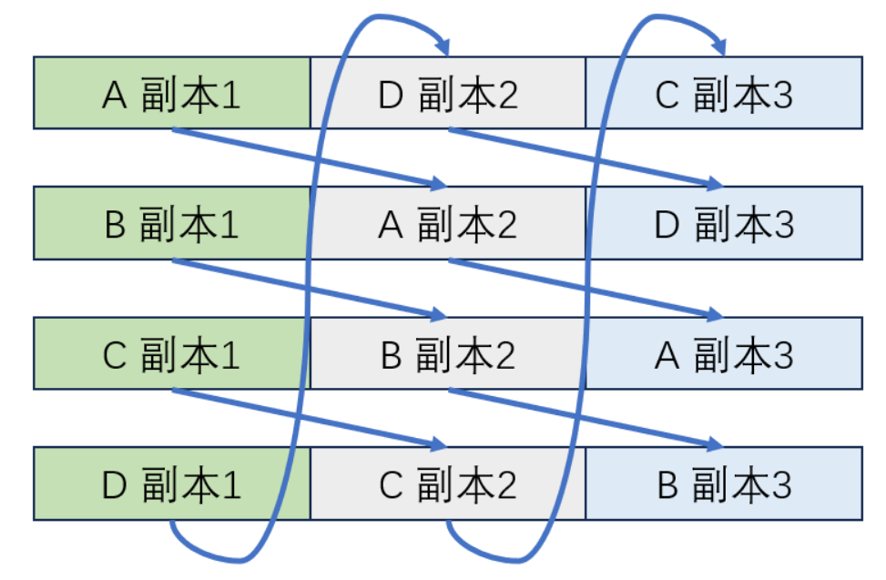

2.  标签**分区的大小和顺序**：根据写入和删除的对象大小计算分区大小；根据读取曲线相似性计算每两个标签之间的余弦相似度，构成一个邻接矩阵，计算分区顺序就是求遍历完所有标签的最短路径，既典型的旅行商TSP问题。

   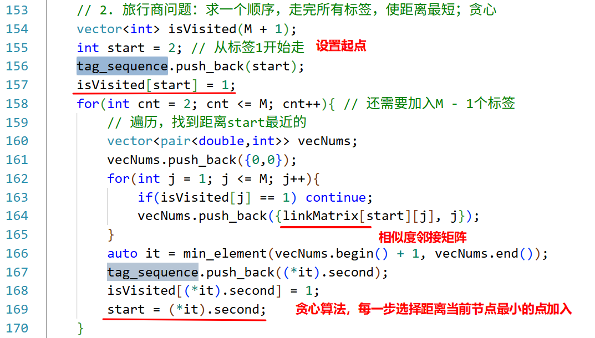

 

# 4. 对象写入策略write_process

将对象的3个副本写入到3个不同磁盘的指定分区。

1. 优化点1：**磁盘负载均衡**，总共N个磁盘，维护每个分区的负载，每次选择3个对应分区负载最低的写入。防止某个磁盘爆内存了。

   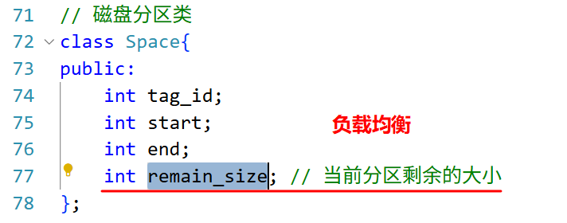

2. 优化点2：**优先连续性存储对象**，能大幅提升读取速度。若对应标签分区写不下，按照标签分区之间的相似度排序，依次查找能够的连续空间存储。都不能连续存储的话，才碎片化存储。

   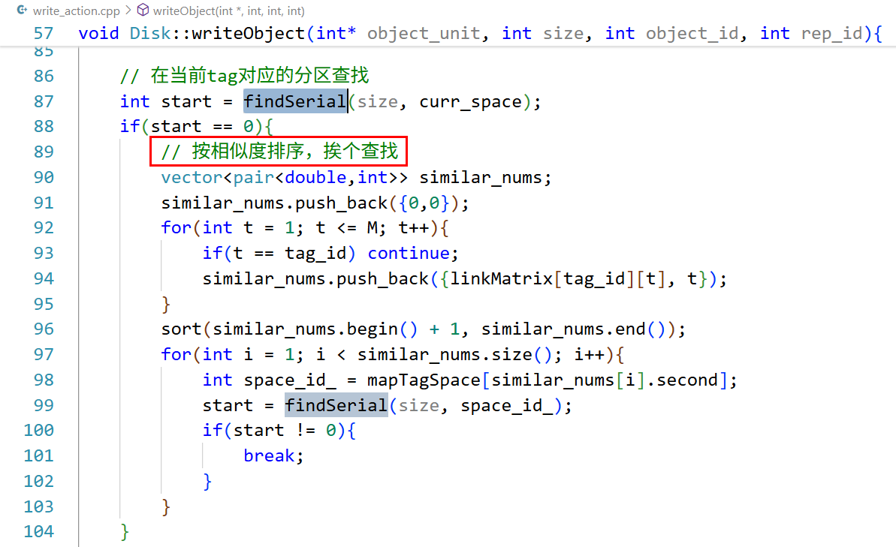

3. 优化点3：**背靠背存储**。每个分区都从头开始的话，分区之间的空隙就比较大。每两个分区，一个从前往后写，一个从后往前写，合成一个大的连续存储区间，进一步提高读取效率。

   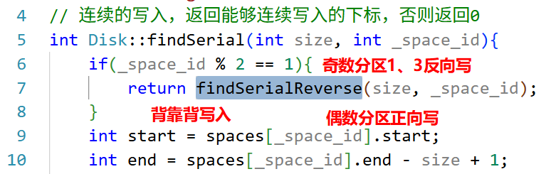

   对象写入效果：

   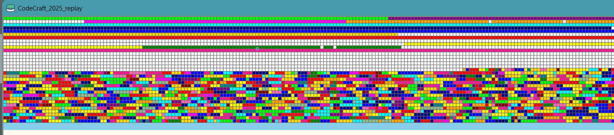

# 5. 对象读取策略read_process

1. 分布式读取：每个对象大小为1到5个分块，可以由不同磁盘读取不同分块，最后组合成一个完整的对象。（分布式读取反倒分更低）。

2. 维护读取请求队列：每个对象都会维护一个读取请求队列。**读取一个完整对象后，所有请求都能同时完成**。（我最开始还以为每个请求都得读取对象一次，导致分数一直不高）。

   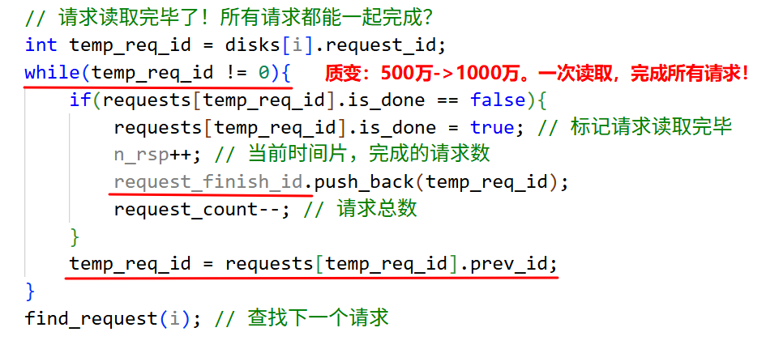

3. **令牌消耗机制**：磁头移动一个存储单元消耗1个令牌，直接跳跃到目的存储单元的话会消耗这个时间片内的所有令牌，只能下个时间片再读取；读取最开始消耗64个令牌，连续读取的话按照0.8倍的关系递减，就64、52、42递减，直到最小的16，所以连续存储和连续读取才能消耗更少的令牌、得到更高的分数。**规划磁头动作**：3种动作，一是直接跳跃到目的存储单元，缺点是会消耗所有令牌，所以距离特别远才会用；第二种动作就是先移动到目的存储单元再读取，适用于中短距离。第三种动作是一直读过去，因为读取后会自动移动到下一个存储单元，适用于短距离。

   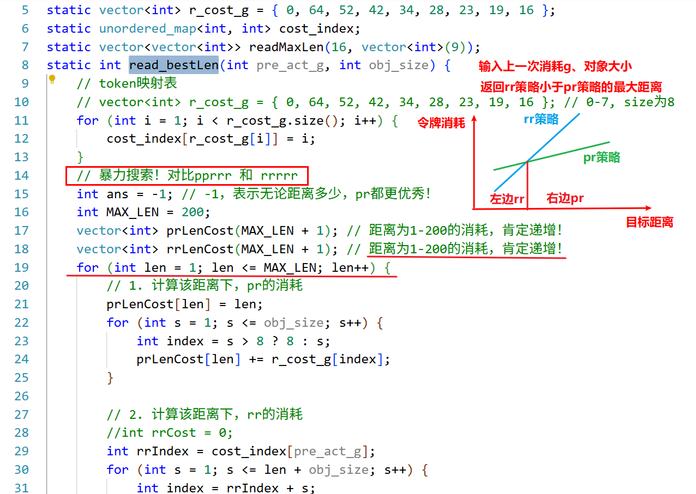

 

**解决bug**：读取的令牌消耗比较错误，先计算再比较！

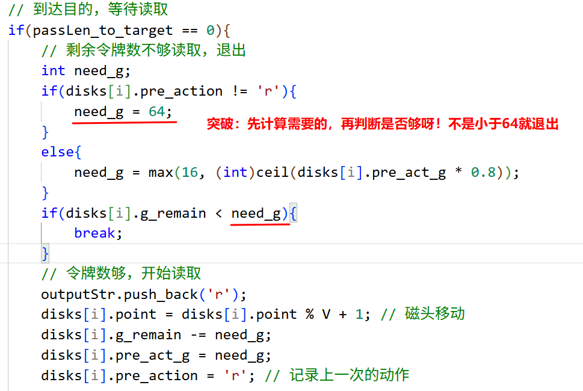

 

 

# 6. 对象删除策略delete_process

对象删除相对比较简单，就是取消对象在每个磁盘的占用标记，同时清空该对象的读取请求队列，最后更新磁盘负载。

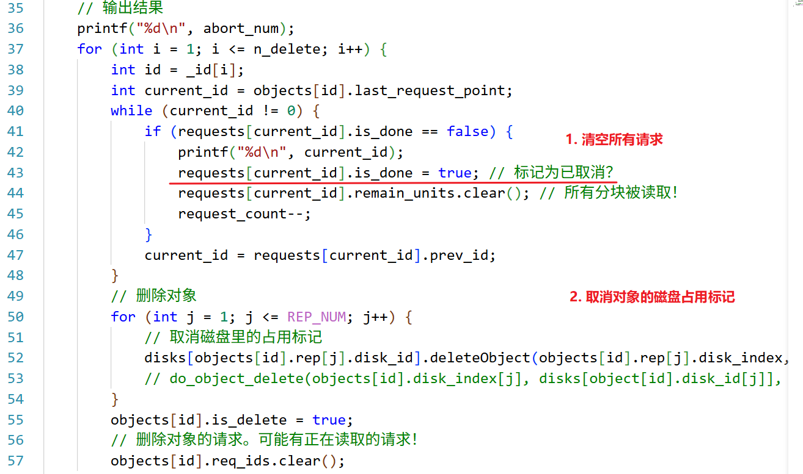

# 7. 其它问题

**问题1**：使用unordered_set集合存储请求未完成的分块，请求数量太多，程序直接爆内存了，编译错误！

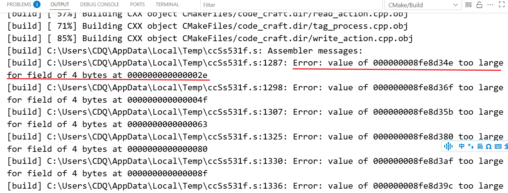

解决：将unordered_set换成只存储0-7的小型集合。

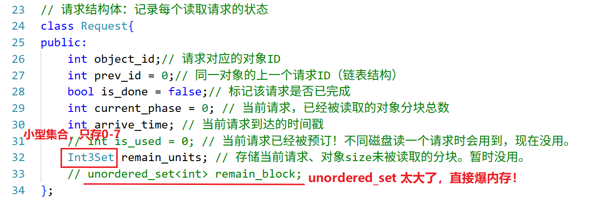

**问题2**：题目有频繁的输入和输出信息，控制台打印调试不好使！

解决：打印到test文件！使用ostringstream ss; 类似cout输入到字符流，转换为字符串写入到文件中。

使用断言assert()，防逻辑错误。

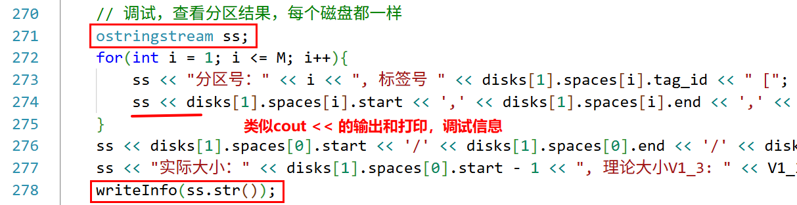

 

 